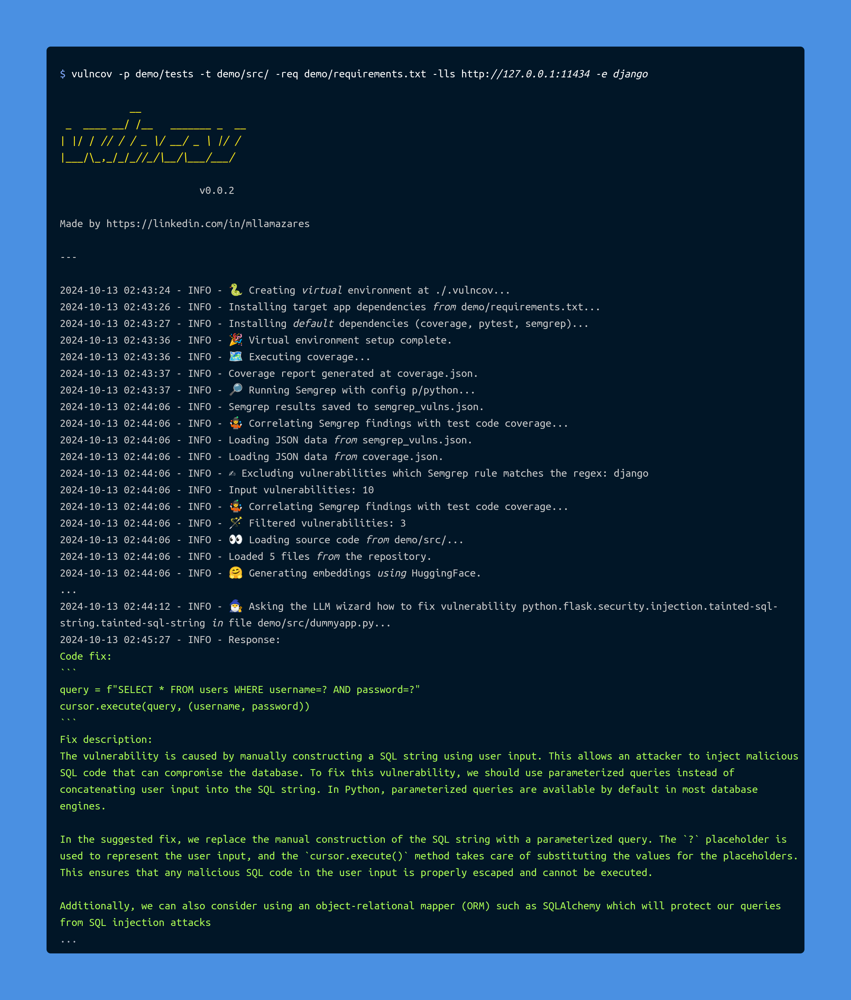

# 🧪 vulncov


[](https://www.linkedin.com/in/mllamazares/)
[](https://github.com/mllamazares/vulncov/watchers)
[](https://github.com/mllamazares/vulncov/stargazers)
[](https://twitter.com/intent/tweet?text=Check%20out%20vulncov%21%20https%3A%2F%2Fgithub.com%2Fmllamazares%2Fvulncov)

`vulncov` is a tool that correlates [Semgrep](https://semgrep.dev/) scans with Python [test code coverage](https://coverage.readthedocs.io/en/latest/index.html) to help identify which potentially vulnerable code has been executed by the unit tests. This helps prioritize SAST findings and reduce false positives.



## Rationale
When analyzing SAST tool output, some findings might be located in parts of the code that are not reachable from the input sources, meaning they are [dead code](https://en.wikipedia.org/wiki/Dead_code) and ultimately pose less risk. At the same time, starting the data flow analysis from the input sources might not connect with those potential findings.

`vulncov` solves this challenge by correlating SAST findings with code coverage data from unit tests. This helps prioritize reachable vulnerabilities and provides insights on how to reach the affected code, as you can identify the test cases associated with specific findings.

Check out the [Demo section](#demo) for an intuitive example.

#### ⚠️ Disclaimer
- This doesn’t mean we should ignore the rest of the SAST output — it's just a way to prioritize.
- It requires good unit tests using [pytest](https://pytest.org/). The higher the coverage, the more reliable the results.
- At this time, this project is just a proof of concept — use it at your own risk!

## Features
- Shows which test cases reach each SAST finding, making it easier to analyze and test the scenario. 🎯
- Calculates the percentage of coverage between the vulnerability and the executed lines. Ideally, all lines flagged by SAST should be executed. 📏
- Generates JSON output with the most relevant Semgrep fields, including the `fingerprint`, making it easier to compare with the original results if needed. 🔗
- Allows excluding Semgrep rules using regex. 🚫
- Lets you run Semgrep and coverage scans or use existing results if you’ve already run the tools. 🃏
- Currently supports Python (more languages [coming soon](#TODO)!). 🐍

## Installation

1. Clone this repo:
    ```shell
    git clone https://github.com/mllamazares/vulncov.git && cd vulncov
    ```
2. Create a virtual environment:
    ```shell
   python -m venv venv && source venv/bin/activate
    ```
3. Install `vulncov`and its dependencies:
    ```shell
    pip install -e . -r requirements.txt
    ```

## Usage

```shell
vulncov -h
```

```
usage: vulncov.py [-h] [-er EXCLUDE_RULE_REGEX] [-o VULNCOV_OUTPUT_FILE] [-q] [-p PYTEST_FOLDER] [-t TARGET_APP] [-os SEMGREP_OUTPUT_FILE] [-oc COVERAGE_OUTPUT_FILE] [-s SEMGREP_JSON_FILE] [-c COVERAGE_JSON_FILE]

Correlates Semgrep findings with Python test code coverage. You can either provide Semgrep and coverage JSON files directly or specify a pytest folder and target app to generate them (see Scenarios below).

options:
  -h, --help            show this help message and exit

Common arguments:
  -er EXCLUDE_RULE_REGEX, --exclude_rule_regex EXCLUDE_RULE_REGEX
                        Exclude Semgrep rules which name matches the provided regex
  -o VULNCOV_OUTPUT_FILE, --vulncov_output_file VULNCOV_OUTPUT_FILE
                        Path to save the output JSON file of Vulncov (optional)
  -q, --quiet           Suppress all output

Scenario 1 - To run coverage and Semgrep before:
  -p PYTEST_FOLDER, --pytest_folder PYTEST_FOLDER
                        Path to the folder containing pytest tests
  -t TARGET_APP, --target_app TARGET_APP
                        Path to the target application source code
  -os SEMGREP_OUTPUT_FILE, --semgrep_output_file SEMGREP_OUTPUT_FILE
                        Path to save the output JSON file of Semgrep (optional)
  -oc COVERAGE_OUTPUT_FILE, --coverage_output_file COVERAGE_OUTPUT_FILE
                        Path to save the output JSON file of Coverage (optional)

Scenario 2 - To use already existing Semgrep and Coverage outputs:
  -s SEMGREP_JSON_FILE, --semgrep_json_file SEMGREP_JSON_FILE
                        Path to the Semgrep JSON file
  -c COVERAGE_JSON_FILE, --coverage_json_file COVERAGE_JSON_FILE
                        Path to the Coverage JSON file
```

## Sample Workflow

There are two main scenarios to use the script:
1. **Scenario 1**: Run Coverage and Semgrep for me.
2. **Scenario 2**: Use already existing Semgrep and Coverage outputs.

Each scenario requires different inputs, as shown in the help section.

### Scenario 1: Run Coverage and Semgrep for me

`vulncov` needs Semgrep and coverage JSON files as input, but if you want `vulncov` to handle everything, just specify the following parameters:

```
  -p PYTEST_FOLDER, --pytest_folder PYTEST_FOLDER
                        Path to the folder containing pytest tests
  -t TARGET_APP, --target_app TARGET_APP
                        Path to the target application source code
```

Example command:
```shell
vulncov -p demo/tests -t demo/
```

#### Installing target app dependencies for Coverage

To run `vulncov` in this mode, be aware that in addition to the initial dependencies, the target app might require additional ones, such as Flask. You can install these by running the following command in the virtual environment:
```shell
pip install -r demo/requirements.txt
```

### Scenario 2: Use already existing Semgrep and Coverage outputs

This is ideal if you’ve already generated these files in a previous step of a CI/CD pipeline. Just specify the following parameters:
```
  -s SEMGREP_JSON_FILE, --semgrep_json_file SEMGREP_JSON_FILE
                        Path to the Semgrep JSON file
  -c COVERAGE_JSON_FILE, --coverage_json_file COVERAGE_JSON_FILE
                        Path to the Coverage JSON file
```

Example command:
```shell
vulncov -s semgrep_vulns.json -c coverage.json 
```

#### Generating valid Coverage scans

Note that you need to run coverage with the [dynamic context](https://coverage.readthedocs.io/en/latest/contexts.html#dynamic-contexts) enabled. To do this, create a `coverage.cfg` file with the following content:

```
[run]
dynamic_context = test_function
```

Then run the coverage specifying the `--rcfile` like this:

```shell
coverage run -m pytest demo/tests/ --rcfile=coverage.cfg
```

Finally, to generate the JSON, make sure to add the `--show-contexts` option, as shown below:
```shell
coverage json -o coverage.json --omit=*/tests/* --show-contexts
```

If you give `vulncov` a coverage file without contexts enabled, it will fail gracefully.

## Demo

The [demo/src](./demo/src/) folder contains a dummy Flask app that checks if a user inputs the correct credentials.

If you look at the code, you'll find the following vulnerabilities marked with comments:

```python
@app.route('/login', methods=['GET'])
def login():
    username = request.args.get('username')
    password = request.args.get('password')
    
    # This will NEVER be triggered
    if 1==2:
        ping()

    conn = get_db_connection()
    cursor = conn.cursor()
    
    # Vulnerable to SQL injection
    query = f"SELECT * FROM users WHERE username='{username}' AND password='{password}'"
    cursor.execute(query)
    
    user = cursor.fetchone()
    conn.close()
    
    if user:
        # Vulnerable to XSS
        return f"Welcome {username}!"
    else:
        return "Invalid credentials!", 403

#@app.route('/ping', methods=['GET'])
def ping():
    ip = request.args.get('ip')
    
    # Vulnerable to command injection
    command = f"ping -c 1 {ip}"
    output = os.popen(command).read()
    
    # Vulnerable to XSS
    return f"<pre>{output}</pre>"
```

As you can see, the `ping` function has its route commented out, so it’s inaccessible externally. It’s also referenced in the login function, but note that it's called only if an impossible condition (`if 1==2`) is met, making it unreachable.

Now, let’s see how the process looks when running a [standalone SAST](#using-a-standalone-sast) versus [using `vulncov`](#using-vulncov).

#### Demo App Setup

After completing the steps in the [Installation](#installation) section, install the additional dependencies for the demo app by running this command in the virtual environment, as pointed out in [Installing target app dependencies](#installing-target-app-dependencies):

```shell
pip install -r demo/requirements.txt
```

### Using a standalone SAST

If we run `semgrep` like this:
```shell
semgrep --config 'p/python' --json --quiet -o /tmp/semgrep_results.json demo/src/
```

And then filter the relevant lines from the JSON file:

```shell
cat /tmp/semgrep_results.json | jq | grep check_id
      "check_id": "python.django.security.injection.sql.sql-injection-using-db-cursor-execute.sql-injection-db-cursor-execute",
      "check_id": "python.django.security.injection.sql.sql-injection-using-db-cursor-execute.sql-injection-db-cursor-execute",
      "check_id": "python.flask.security.injection.tainted-sql-string.tainted-sql-string",
      "check_id": "python.flask.db.generic-sql-flask.generic-sql-flask",
      "check_id": "python.flask.security.audit.directly-returned-format-string.directly-returned-format-string",
      "check_id": "python.lang.security.dangerous-system-call.dangerous-system-call",
      "check_id": "python.flask.security.audit.directly-returned-format-string.directly-returned-format-string",
      "check_id": "python.django.security.injection.raw-html-format.raw-html-format",
      "check_id": "python.flask.security.injection.raw-html-concat.raw-html-format",
```

The main issue here is that it's flagging functions like `dangerous-system-call` that are dead code, as explained in the [Demo section](#demo).

### Using `vulncov` 🪄

Simply run this command:

```shell
vulncov -p demo/tests -t demo/src/ -e django -o /tmp/vulncov.json
```

Explanation:
- `-p demo/tests`: the pytest folder where the coverage will be extracted.
- `-t demo/src/`: the folder containing the target application’s source code.
- `-e django`: regex to exclude rules from the output. Since we used `p/python`, it includes different frameworks like Flask and Django, as well as generic rules (`lang`). This parameter helps omit those from the output.

Here’s the output of the execution:
```
            __
 _  ____ __/ /__  _______ _  __
| |/ / // / / _ \/ __/ _ \ |/ /
|___/\_,_/_/_//_/\__/\___/___/

                        v0.0.1

Made by https://linkedin.com/in/mllamazares

---

2024-09-01 04:11:52 - INFO - Executing coverage...
2024-09-01 04:11:53 - INFO - Coverage report generated at coverage.json.
2024-09-01 04:11:53 - INFO - Running Semgrep with config p/python...
2024-09-01 04:12:06 - INFO - Semgrep results saved to semgrep_vulns.json.
2024-09-01 04:12:06 - INFO - Initializing VulnCov with Semgrep and coverage data.
2024-09-01 04:12:06 - INFO - Loading JSON data from semgrep_vulns.json.
2024-09-01 04:12:06 - INFO - Loading JSON data from coverage.json.
2024-09-01 04:12:06 - INFO - Validating coverage structure.
2024-09-01 04:12:06 - INFO - Excluding vulnerabilities with Semgrep rules matching the regex: django
2024-09-01 04:12:06 - INFO - Initial vulnerabilities: 9
2024-09-01 04:12:06 - INFO - Matching Semgrep findings with coverage data...
2024-09-01 04:12:06 - INFO - Matched vulnerabilities: 3
2024-09-01 04:12:06 - INFO - Vulnerability coverage results saved to /tmp/vulncov.json.
```

We can see it filtered the 9 initial Semgrep findings down to 3!

```shell
cat /tmp/vulncov.json | jq | grep check_id
        "check_id": "python.flask.security.injection.tainted-sql-string.tainted-sql-string",
        "check_id": "python.flask.db.generic-sql-flask.generic-sql-flask",
        "check_id": "python.flask.security.audit.directly-returned-format-string.directly-returned-format-string",
```

It omitted vulnerabilities from dead code, like `dangerous-system-call`, and removed redundant findings, such as one of the `directly-returned-format-string` checks and the Django references.

Additionally, the output includes information on which test cases can trigger each vulnerability under `test_cases`. Here’s an example of one:

```json
    {
      "semgrep": {
        "fingerprint": "b4eef3e24a2d73ef7d175f282bcd378d246402e39579f7a1ce45444e6c930fbae8d84a7a0f40f61df0fef257687103f732e3368fd0218ebf41d9058a3f827396_0",
        "check_id": "python.flask.security.injection.tainted-sql-string.tainted-sql-string",
        "rule_category": "security",
        "vulnerability_class": [
          "Improper Validation"
        ],
        "impact": "MEDIUM",
        "message": "Detected user input used to manually construct a SQL string. This is usually bad practice because manual construction could accidentally result in a SQL injection. An attacker could use a SQL injection to steal or modify contents of the database. Instead, use a parameterized query which is available by default in most database engines. Alternatively, consider using an object-relational mapper (ORM) such as SQLAlchemy which will protect your queries.",
        "lines": "    query = f\"SELECT * FROM users WHERE username='{username}' AND password='{password}'\"",
        "vuln_lines": [
          31
        ]
      },
      "test_cases": [
        {
          "name": "login_test.test_login_success",
          "executed_lines": [
            11,
            12,
            24,
            25,
            27,
            28,
            31,
            32,
            34,
            35,
            37,
            39
          ],
          "matched_lines": [
            31
          ],
          "coverage_match_percentage": 100.0
        },
        {
          "name": "login_test.test_login_failure",
          "executed_lines": [
            11,
            12,
            24,
            25,
            27,
            28,
            31,
            32,
            34,
            35,
            37,
            41
          ],
          "matched_lines": [
            31
          ],
          "coverage_match_percentage": 100.0
        }
      ]
    },
```

## Output JSON structure

Below is a detailed breakdown of the `vulncov` JSON structure:

### `summary`
The `summary` object provides an overview of the entire analysis:

- **semgrep_input_file**: The name of the JSON file with Semgrep scan results (`semgrep_vulns.json`).
- **coverage_input_file**: The name of the JSON file with code coverage data (`coverage.json`).
- **uid**: A unique identifier (UUID) for this analysis session.
- **timestamp**: The date and time when the analysis was conducted.
- **number_vulnerabilities_input**: The total number of vulnerabilities detected in the Semgrep input file.
- **number_vulnerabilities_matched**: The number of vulnerabilities from Semgrep that were matched with executed lines in the test coverage data.

### `matched_results`
The `matched_results` array contains detailed information about each detected vulnerability that was matched with executed test cases. Each object in this array includes the following:

- **semgrep**: An object detailing a specific vulnerability identified by Semgrep.
  - **fingerprint**: A unique identifier for the vulnerability, often a hash value representing the location and nature of the issue.
  - **check_id**: The ID of the Semgrep rule that detected the vulnerability.
  - **rule_category**: The category of the rule, usually indicating the type of security issue (e.g., "security").
  - **vulnerability_class**: A list of classes that describe the nature of the vulnerability (e.g., "SQL Injection", "Cross-Site Scripting").
  - **impact**: The severity level of the vulnerability (e.g., "MEDIUM", "HIGH").
  - **message**: A detailed description of the vulnerability, its potential impact, and suggested remediation.
  - **lines**: The specific line of code in the source file where the vulnerability was detected.
  - **vuln_lines**: An array indicating the exact line numbers in the source code that are vulnerable.

- **test_cases**: An array of test case objects that were executed and matched with the vulnerability identified by Semgrep.
  - **name**: The name of the test case.
  - **executed_lines**: An array of line numbers that were executed during the test case.
  - **matched_lines**: An array of line numbers that both correspond to the vulnerability and were executed during the test case.
  - **coverage_match_percentage**: The percentage of vulnerable lines that were covered by the test case.

## TODO
- [ ] Support other languages, not just Python. 🌍
- [ ] Simplify the installation process (probably via docker). 🐋
- [ ] Clean and refactor code. 🧹

Contributions are welcome! Feel free to submit a PR. 🙌