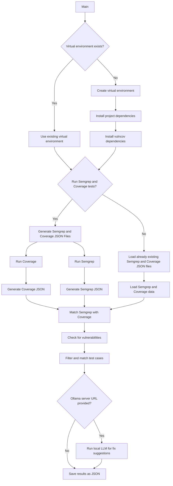

# 🧪 vulncov


[](https://www.linkedin.com/in/mllamazares/)
[](https://github.com/mllamazares/vulncov/watchers)
[](https://github.com/mllamazares/vulncov/stargazers)
[](https://twitter.com/intent/tweet?text=Check%20out%20vulncov%21%20https%3A%2F%2Fgithub.com%2Fmllamazares%2Fvulncov)

`vulncov` correlates [Semgrep](https://semgrep.dev/) scans with Python [test code coverage](https://coverage.readthedocs.io/en/latest/index.html) to identify which vulnerable code has been executed by unit tests, helping prioritize SAST findings and reduce false positives. It also leverages a self-hosted LLM to suggest bug fixes!


## Rationale
When analyzing SAST tool output, some findings might be located in parts of the code that are not reachable from the input sources, meaning they are [dead code](https://en.wikipedia.org/wiki/Dead_code) and ultimately pose less risk. At the same time, starting the data flow analysis from the input sources might not connect with those potential findings.

`vulncov` solves this challenge by correlating SAST findings with code coverage data from unit tests. This helps prioritize reachable vulnerabilities and provides insights on how to reach the affected code, as you can identify the test cases associated with specific findings.

Check out the [Demo Wiki page](https://github.com/mllamazares/vulncov/wiki/2.-SAST-vs-Vulncov-demo) for an intuitive, end-to-end example.

#### ⚠️ Disclaimer
- This doesn’t mean we should ignore the rest of the SAST output — it's just a way to prioritize.
- It requires *decent* unit tests using [pytest](https://pytest.org/): the higher the coverage, the more reliable the results.
- At this time, this project is just a PoC — use it at your own risk!

## Features
- Shows which test cases reach each SAST finding, making it easier to analyze and test the scenario. 🎯
- Calculates the percentage of coverage between the vulnerability and the executed lines. Ideally, all lines flagged by SAST should be executed. 📏
- Generates JSON output with the most relevant Semgrep fields, including the `fingerprint`, making it easier to compare with the original results if needed. 🔗
- Leverages self-hosted, 110% private LLM to suggest bug fixes! 🧙‍♂️
- Allows excluding Semgrep rules using regex. 🚫
- Lets you run Semgrep and coverage scans or use existing results if you’ve already run the tools. 🃏
- Currently supports Python (more languages [coming soon](#TODO)?). 🐍

## Process Flow Diagram



## Installation

You can simply install `vulncov` with [`pipx`](https://github.com/pypa/pipx) like this:
```shell
pipx install git+https://github.com/mllamazares/vulncov.git
```

## Usage

```shell
vulncov -h
```

```
usage: vulncov [-h] [-er EXCLUDE_RULE_REGEX] [-o VULNCOV_OUTPUT_FILE] [-lls OLLAMA_SERVER] [-llm OLLAMA_MODEL] [-q] [-p PYTEST_FOLDER] [-t TARGET_APP] [-req REQ_FILE] [-ve VENV_PATH] [-sc SEMGREP_CONFIG] [-os SEMGREP_OUTPUT_FILE] [-oc COVERAGE_OUTPUT_FILE] [-s SEMGREP_JSON_FILE] [-c COVERAGE_JSON_FILE]

Correlates Semgrep findings with Python test code coverage. You can either provide Semgrep and coverage JSON files directly or specify a pytest folder and target app to generate them.

options:
  -h, --help            show this help message and exit

Common arguments:
  -er EXCLUDE_RULE_REGEX, --exclude_rule_regex EXCLUDE_RULE_REGEX
                        Exclude Semgrep rules which name matches the provided regex.
  -o VULNCOV_OUTPUT_FILE, --vulncov_output_file VULNCOV_OUTPUT_FILE
                        Path to save the output JSON file of Vulncov (optional).
  -lls OLLAMA_SERVER, --ollama_server OLLAMA_SERVER
                        Ollama server URL (optional). If not specified, the LLM fix suggestion will not be triggered.
  -llm OLLAMA_MODEL, --ollama_model OLLAMA_MODEL
                        Ollama LLM model to be used (optional).
  -q, --quiet           Suppress all output.

Option 1 - To run coverage and Semgrep before:
  -p PYTEST_FOLDER, --pytest_folder PYTEST_FOLDER
                        Path to the folder containing pytest tests.
  -t TARGET_APP, --target_app TARGET_APP
                        Path to the target application source code.
  -req REQ_FILE, --req_file REQ_FILE
                        Path to the requirements file for the target app.
  -ve VENV_PATH, --venv_path VENV_PATH
                        The path where the virtual environment will be created.
  -sc SEMGREP_CONFIG, --semgrep_config SEMGREP_CONFIG
                        Specify the rules configuration to execute Semgrep (optional).
  -os SEMGREP_OUTPUT_FILE, --semgrep_output_file SEMGREP_OUTPUT_FILE
                        Path to save the output JSON file of Semgrep (optional).
  -oc COVERAGE_OUTPUT_FILE, --coverage_output_file COVERAGE_OUTPUT_FILE
                        Path to save the output JSON file of coverage (optional).

Option 2 - To feed already existing Semgrep and coverage outputs:
  -s SEMGREP_JSON_FILE, --semgrep_json_file SEMGREP_JSON_FILE
                        Path to the Semgrep JSON file.
  -c COVERAGE_JSON_FILE, --coverage_json_file COVERAGE_JSON_FILE
                        Path to the coverage JSON file.
```

### Documentation & Demo

Curious about how to use VulnCov? Check out the [Wiki](https://github.com/mllamazares/vulncov/wiki) for details on:
- [Execution Modes](https://github.com/mllamazares/vulncov/wiki/1.-Execution-Modes)
- [SAST vs. VulnCov Demo](https://github.com/mllamazares/vulncov/wiki/2.-SAST-vs-Vulncov-demo)
- [Output JSON Structure](https://github.com/mllamazares/vulncov/wiki/3.-Output-JSON-Structure)

## TODO
- [ ] Add support to other languages, not just Python. 🌍
- [ ] Add unit tests. 🧹

Contributions are welcome! Feel free to submit a PR. 🙌