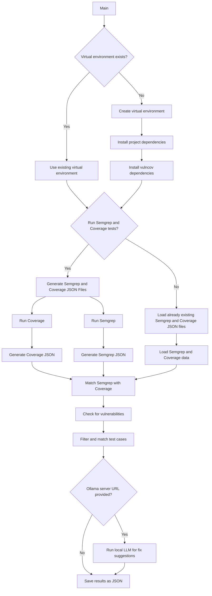

# 🧪 vulncov


[](https://www.linkedin.com/in/mllamazares/)
[](https://github.com/mllamazares/vulncov/watchers)
[](https://github.com/mllamazares/vulncov/stargazers)
[](https://twitter.com/intent/tweet?text=Check%20out%20vulncov%21%20https%3A%2F%2Fgithub.com%2Fmllamazares%2Fvulncov)

`vulncov` correlates [Semgrep](https://semgrep.dev/) scans with Python [test code coverage](https://coverage.readthedocs.io/en/latest/index.html) to help identify which vulnerable code has been executed by the unit tests. This helps prioritize SAST findings and reduce false positives.


## Rationale
When analyzing SAST tool output, some findings might be located in parts of the code that are not reachable from the input sources, meaning they are [dead code](https://en.wikipedia.org/wiki/Dead_code) and ultimately pose less risk. At the same time, starting the data flow analysis from the input sources might not connect with those potential findings.

`vulncov` solves this challenge by correlating SAST findings with code coverage data from unit tests. This helps prioritize reachable vulnerabilities and provides insights on how to reach the affected code, as you can identify the test cases associated with specific findings.

Check out the [Demo section](#demo) for an intuitive example.

#### ⚠️ Disclaimer
- This doesn’t mean we should ignore the rest of the SAST output — it's just a way to prioritize.
- It requires *decent* unit tests using [pytest](https://pytest.org/): the higher the coverage, the more reliable the results.
- At this time, this project is just a PoC — use it at your own risk!

## Features
- Shows which test cases reach each SAST finding, making it easier to analyze and test the scenario. 🎯
- Calculates the percentage of coverage between the vulnerability and the executed lines. Ideally, all lines flagged by SAST should be executed. 📏
- Generates JSON output with the most relevant Semgrep fields, including the `fingerprint`, making it easier to compare with the original results if needed. 🔗
- Leverages self-hosted, 100% private LLM to suggest bug fixes! 🧙‍♂️
- Allows excluding Semgrep rules using regex. 🚫
- Lets you run Semgrep and coverage scans or use existing results if you’ve already run the tools. 🃏
- Currently supports Python (more languages [coming soon](#TODO)?). 🐍

## Process Flow Diagram



## Installation

You can simply install `vulncov` with [`pipx`](https://github.com/pypa/pipx) like this:
```shell
pipx install git+https://github.com/mllamazares/vulncov.git
```

## Usage

```shell
vulncov -h
```

```
usage: vulncov [-h] [-er EXCLUDE_RULE_REGEX] [-o VULNCOV_OUTPUT_FILE] [-lls OLLAMA_SERVER] [-llm OLLAMA_MODEL] [-q] [-p PYTEST_FOLDER] [-t TARGET_APP] [-req REQ_FILE] [-ve VENV_PATH] [-sc SEMGREP_CONFIG] [-os SEMGREP_OUTPUT_FILE] [-oc COVERAGE_OUTPUT_FILE] [-s SEMGREP_JSON_FILE] [-c COVERAGE_JSON_FILE]

Correlates Semgrep findings with Python test code coverage. You can either provide Semgrep and coverage JSON files directly or specify a pytest folder and target app to generate them.

options:
  -h, --help            show this help message and exit

Common arguments:
  -er EXCLUDE_RULE_REGEX, --exclude_rule_regex EXCLUDE_RULE_REGEX
                        Exclude Semgrep rules which name matches the provided regex.
  -o VULNCOV_OUTPUT_FILE, --vulncov_output_file VULNCOV_OUTPUT_FILE
                        Path to save the output JSON file of Vulncov (optional).
  -lls OLLAMA_SERVER, --ollama_server OLLAMA_SERVER
                        Ollama server URL (optional). If not specified, the LLM fix suggestion will not be triggered.
  -llm OLLAMA_MODEL, --ollama_model OLLAMA_MODEL
                        Ollama LLM model to be used (optional).
  -q, --quiet           Suppress all output.

Option 1 - To run coverage and Semgrep before:
  -p PYTEST_FOLDER, --pytest_folder PYTEST_FOLDER
                        Path to the folder containing pytest tests.
  -t TARGET_APP, --target_app TARGET_APP
                        Path to the target application source code.
  -req REQ_FILE, --req_file REQ_FILE
                        Path to the requirements file for the target app.
  -ve VENV_PATH, --venv_path VENV_PATH
                        The path where the virtual environment will be created.
  -sc SEMGREP_CONFIG, --semgrep_config SEMGREP_CONFIG
                        Specify the rules configuration to execute Semgrep (optional).
  -os SEMGREP_OUTPUT_FILE, --semgrep_output_file SEMGREP_OUTPUT_FILE
                        Path to save the output JSON file of Semgrep (optional).
  -oc COVERAGE_OUTPUT_FILE, --coverage_output_file COVERAGE_OUTPUT_FILE
                        Path to save the output JSON file of coverage (optional).

Option 2 - To feed already existing Semgrep and coverage outputs:
  -s SEMGREP_JSON_FILE, --semgrep_json_file SEMGREP_JSON_FILE
                        Path to the Semgrep JSON file.
  -c COVERAGE_JSON_FILE, --coverage_json_file COVERAGE_JSON_FILE
                        Path to the coverage JSON file.
```

## Sample Workflow

There are two main scenarios to use the script:
1. **Scenario 1**: Run Coverage and Semgrep for me.
2. **Scenario 2**: Use already existing Semgrep and Coverage outputs.

Each scenario requires different inputs, as shown in the help section.

### Scenario 1: Run Coverage and Semgrep for me

`vulncov` needs Semgrep and coverage JSON files as input, but if you want `vulncov` to handle everything, just specify the following parameters:

```
  -p PYTEST_FOLDER, --pytest_folder PYTEST_FOLDER
                        Path to the folder containing pytest tests.
  -t TARGET_APP, --target_app TARGET_APP
                        Path to the target application source code.
  -req REQ_FILE, --req_file REQ_FILE
                        Path to the requirements file for the target app.
```

Example command:
```shell
vulncov -p demo/tests -t demo/ -req demo/requirements.txt
```

### Scenario 2: Use already existing Semgrep and Coverage outputs

This is ideal if you’ve already generated these files in a previous step of a CI/CD pipeline. Just specify the following parameters:
```
  -s SEMGREP_JSON_FILE, --semgrep_json_file SEMGREP_JSON_FILE
                        Path to the Semgrep JSON file
  -c COVERAGE_JSON_FILE, --coverage_json_file COVERAGE_JSON_FILE
                        Path to the Coverage JSON file
```

Example command:
```shell
vulncov -s semgrep_vulns.json -c coverage.json 
```

#### Generating *compatible* Coverage scans

Note that you need to run coverage with the [dynamic context](https://coverage.readthedocs.io/en/latest/contexts.html#dynamic-contexts) enabled. To do this, create a `coverage.cfg` file with the following content:

```
[run]
dynamic_context = test_function
```

Then run the coverage specifying the `--rcfile` like this:

```shell
coverage run -m pytest demo/tests/ --rcfile=coverage.cfg
```

Finally, to generate the JSON, make sure to add the `--show-contexts` option, as shown below:
```shell
coverage json -o coverage.json --omit=*/tests/* --show-contexts
```

If you give `vulncov` a coverage file without contexts enabled, it will fail gracefully.


---

## Demo

The [demo/src](./demo/src/) folder contains a dummy Flask app that checks if a user inputs the correct credentials.

If you look at the code, you'll find the following vulnerabilities marked with comments:

```python
@app.route('/login', methods=['GET'])
def login():
    username = request.args.get('username')
    password = request.args.get('password')
    
    # This will NEVER be triggered
    if 1==2:
        ping()

    conn = get_db_connection()
    cursor = conn.cursor()
    
    # Vulnerable to SQL injection
    query = f"SELECT * FROM users WHERE username='{username}' AND password='{password}'"
    cursor.execute(query)
    
    user = cursor.fetchone()
    conn.close()
    
    if user:
        # Vulnerable to XSS
        return f"Welcome {username}!"
    else:
        return "Invalid credentials!", 403

#@app.route('/ping', methods=['GET'])
def ping():
    ip = request.args.get('ip')
    
    # Vulnerable to command injection
    command = f"ping -c 1 {ip}"
    output = os.popen(command).read()
    
    # Vulnerable to XSS
    return f"<pre>{output}</pre>"
```

As you can see, the `ping()` function has its route commented out, so it’s inaccessible externally. It’s also referenced in the login function, but note that it's called only if an impossible condition (`if 1==2`) is met, making it still unreachable.

Additionally, there's a folder called [demo/tests](.demo/tests) containing a file with two pytest unit tests. Each test verifies that the credential verification workflow works as expected.

Now, let’s see how the process looks when running a [standalone SAST](#using-a-standalone-sast) versus [using `vulncov`](#using-vulncov).

### Using a standalone SAST 🥱

If we run `semgrep` like this:
```shell
semgrep --config 'p/python' --json --quiet -o /tmp/semgrep_results.json demo/src/
```

And then filter the relevant lines from the JSON file:

```shell
cat /tmp/semgrep_results.json | jq | grep check_id
```

```json
      "check_id": "python.django.security.injection.sql.sql-injection-using-db-cursor-execute.sql-injection-db-cursor-execute",
      "check_id": "python.django.security.injection.sql.sql-injection-using-db-cursor-execute.sql-injection-db-cursor-execute",
      "check_id": "python.flask.security.injection.tainted-sql-string.tainted-sql-string",
      "check_id": "python.flask.db.generic-sql-flask.generic-sql-flask",
      "check_id": "python.flask.security.audit.directly-returned-format-string.directly-returned-format-string",
      "check_id": "python.lang.security.dangerous-system-call.dangerous-system-call",
      "check_id": "python.flask.os.tainted-os-command-stdlib-flask-secure-if-array.tainted-os-command-stdlib-flask-secure-if-array",
      "check_id": "python.flask.security.audit.directly-returned-format-string.directly-returned-format-string",
      "check_id": "python.django.security.injection.raw-html-format.raw-html-format",
      "check_id": "python.flask.security.injection.raw-html-concat.raw-html-format",
```

The main issue here is that it's flagging functions like `dangerous-system-call` which is in `ping()` function (dead code), as explained in the [Demo section](#demo).

### Using `vulncov` 🪄

Simply run this command:

```shell
vulncov -p demo/tests -t demo/src/ -e django -o /tmp/vulncov.json -req demo/requirements.txt
```

Explanation:
- `-p demo/tests`: the pytest folder where the coverage will be extracted.
- `-t demo/src/`: the folder containing the target application’s source code.
- `-e django`: regex to exclude rules from the output. Since we used `p/python`, it includes different frameworks like Flask and Django, as well as generic rules (`lang`). This parameter helps omit those from the output.
- `-o /tmp/vulncov.json`: the output file for storing `vulncov`'s results.
- `-req demo/requirements.txt`: the library dependencies required to run the application, since we want `vulncov` to run coverage for us.

When we inspect the output JSON, it filtered the initial 10 Semgrep findings down to just 3! 🎉

```shell
cat /tmp/vulncov.json | jq | grep check_id
```
```json
        "check_id": "python.flask.security.injection.tainted-sql-string.tainted-sql-string",
        "check_id": "python.flask.db.generic-sql-flask.generic-sql-flask",
        "check_id": "python.flask.security.audit.directly-returned-format-string.directly-returned-format-string",
```

It omitted vulnerabilities from dead code, like `dangerous-system-call`, and removed redundant findings, such as one of the `directly-returned-format-string` checks and the Django references.

The output includes information on which test cases can trigger each vulnerability. Let's review an example:

```json
{
  "semgrep": {
    "fingerprint": "babc5e12b8a3765aa6b292fbc07947825755a8ef203a0ef83775983593273e5596e3ce2f25dde92ecdaf40847a576c05508c6cb50f0fd37c61cfad9c5e8f2146_0",
    "check_id": "python.flask.security.audit.directly-returned-format-string.directly-returned-format-string",
    "rule_category": "security",
    "vulnerability_class": [
      "Cross-Site-Scripting (XSS)"
    ],
    "impact": "MEDIUM",
    "message": "Detected Flask route directly returning a formatted string. This is subject to cross-site scripting if user input can reach the string. Consider using the template engine instead and rendering pages with 'render_template()'.",
    "lines": "        return f\"Welcome {username}!\"",
    "vuln_lines": [
      43
    ]
  },
  "test_cases": [
    {
      "name": "login_test.test_login_success",
      "executed_lines": [
        11,
        12,
        24,
        25,
        28,
        31,
        32,
        35,
        36,
        38,
        39,
        41,
        43
      ],
      "matched_lines": [
        43
      ],
      "coverage_match_percentage": 100.0
    }
  ]
}
```

Check out the detail of the [Output JSON structure](#output-json-structure).

As you can see, this third item has only one test case associated with it, `login_test.test_login_success`, while the others also have `login_test.test_login_failure`. This is because [line 43](./demo/src/dummyapp.py#L43) contains a potential XSS vulnerability, triggered only when a login is successful:

```python
    if user:
        # Vulnerable to XSS
        return f"Welcome {username}!"
    else:
        return "Invalid credentials!", 403
```

This way, `vulncov` also provides a clue on how to trigger each Semgrep finding, as we have the corresponding test case. 🤓

### Suggesting Fixes with the AppSec Wizard 🧙‍♂️

To get private bug fixes powered by a local LLM, you need to install [ollama](https://ollama.com/download) and [pull a model](https://ollama.com/library).

In this case, I will be using `codellama:latest`:

```shell
ollama pull codellama:latest
```

Serve the model by running:

```shell
ollama serve
```

Finally, in a separate terminal, run `vulncov`, passing the URL of the `ollama` instance (it runs on port 11434 by default):

```shell
vulncov -p demo/tests -t demo/src/ -req demo/requirements.txt -lls http://localhost:11434
```

This way, the generated JSON output will now include a field called `llm_suggested_fix`. Let's see an example for SQL Injection:

    Code fix:
    ```
    query = f"SELECT * FROM users WHERE username=? AND password=?"
    cursor.execute(query, (username, password))
    ```

    Fix description:
    The vulnerability is caused by manually constructing a SQL string using user input. This allows an attacker to inject malicious SQL code that can compromise the database. To fix this vulnerability, we should use parameterized queries instead of concatenating user input into the SQL string. In Python, parameterized queries are available by default in most database engines.

    In the suggested fix, we replace the manual construction of the SQL string with a parameterized query. The `?` placeholder is used to represent the user input, and the `cursor.execute()` method takes care of substituting the values for the placeholders. This ensures that any malicious SQL code in the user input is properly escaped and cannot be executed.

    Additionally, we can also consider using an object-relational mapper (ORM) such as SQLAlchemy which will protect our queries from SQL injection attacks.

## Output JSON structure

Below is a detailed breakdown of the `vulncov` JSON structure:

### `summary`
The `summary` object provides an overview of the entire analysis:

- **semgrep_input_file**: The name of the JSON file with Semgrep scan results (`semgrep_vulns.json`).
- **coverage_input_file**: The name of the JSON file with code coverage data (`coverage.json`).
- **uid**: A unique identifier (UUID) for this analysis session.
- **timestamp**: The date and time when the analysis was conducted.
- **number_vulnerabilities_input**: The total number of vulnerabilities detected in the Semgrep input file.
- **number_vulnerabilities_matched**: The number of vulnerabilities from Semgrep that were matched with executed lines in the test coverage data.

### `matched_results`
The `matched_results` array contains detailed information about each detected vulnerability that was matched with executed test cases. Each object in this array includes the following:

- **semgrep**: An object detailing a specific vulnerability identified by Semgrep.
  - **fingerprint**: A unique identifier for the vulnerability, often a hash value representing the location and nature of the issue.
  - **check_id**: The ID of the Semgrep rule that detected the vulnerability.
  - **rule_category**: The category of the rule, usually indicating the type of security issue (e.g., "security").
  - **vulnerability_class**: A list of classes that describe the nature of the vulnerability (e.g., "SQL Injection", "Cross-Site Scripting").
  - **impact**: The severity level of the vulnerability (e.g., "MEDIUM", "HIGH").
  - **message**: A detailed description of the vulnerability, its potential impact, and suggested remediation.
  - **lines**: The specific line of code in the source file where the vulnerability was detected.
  - **vuln_lines**: An array indicating the exact line numbers in the source code that are vulnerable.
  - **llm_suggested_fix**: A fix suggestion provided by the LLM. It includes a code fix and also a detailed explanation.

- **test_cases**: An array of test case objects that were executed and matched with the vulnerability identified by Semgrep.
  - **name**: The name of the test case.
  - **executed_lines**: An array of line numbers that were executed during the test case.
  - **matched_lines**: An array of line numbers that both correspond to the vulnerability and were executed during the test case.
  - **coverage_match_percentage**: The percentage of vulnerable lines that were covered by the test case.

## TODO
- [ ] Add support to other languages, not just Python. 🌍
- [ ] Add unit tests. 🧹
- [ ] Add changelog.

Contributions are welcome! Feel free to submit a PR. 🙌